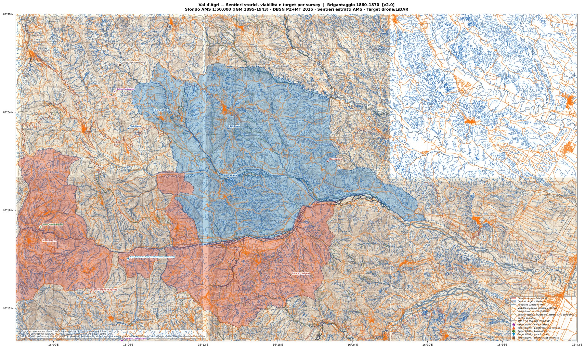

# Val d'Agri — Ricerca Storico-Cartografica (1860-1870)

> Georeferenziamento di carte militari ottocentesche per la ricerca sul brigantaggio post-unitario in Basilicata.

## Mappa output

[](docs/mappa_valdagri_preview.jpg)

*v2.0 — Sfondo: 5 fogli AMS 1:50,000 (IGM 1895–1943). Overlay: confini comunali, idrografia, viabilità moderna DBSN 2025, **sentieri storici/mulattiere estratti automaticamente** (verde tratteggiato, 462 segmenti), **target per survey drone+LiDAR** (simboli colorati: doline carsiche ★ viola, timpe/pareti ^ arancio, boschi rifugio ✚ verde, gole fluviali ▽ azzurro). Risoluzione originale: 6443×3847 px, 300 dpi.*

---

## Stato del progetto

| Fase | Stato | Data |
|------|-------|------|
| FASE 0 — Ispezione dati DBSN | COMPLETATA ✓ | 2026-08-22 |
| FASE 1 — Reperimento mappe storiche 1860-1870 | PARZIALE ⚠️ | 2026-08-22 |
| FASE 1b — Fogli AMS 1:50,000 (University of Texas) | COMPLETATA ✓ | 2026-09-04 |
| FASE 2 — Setup ambiente tecnico | COMPLETATA ✓ | 2026-09-04 |
| FASE 3 — Georeferenziamento (5 fogli) | COMPLETATA ✓ | 2026-09-04 |
| FASE 4 — Mappa overlay AMS + DBSN PZ+MT | COMPLETATA ✓ | 2026-09-04 |
| FASE 5 — Estrazione sentieri storici + target drone/LiDAR | COMPLETATA ✓ | 2026-09-04 |

---

## FASE 0 — Risultati ispezione dati

### File esaminato
- **Sorgente:** `E:\PZ_dbsn_2025-07-28.zip` (≈500 MB)
- **Estratto in:** `data/dbsn_potenza/`
- **Formato:** ESRI File Geodatabase (`Potenza_dbsn.gdb`)

### Diagnosi: dato MODERNO (non storico)

Il file è il **DBSN — Database di Sintesi Nazionale** prodotto dall'IGM,
aggiornato al **14 luglio 2025**. Non contiene nulla di relativo al periodo
1860-1870. È un dato vettoriale moderno integrato da: Regioni, ISTAT,
Open Geo Data ministeriali, Agenzia Entrate 2017, OpenStreetMap.

**Sistema di riferimento:** EPSG:7794 (RDN2008/Italy zone E-N) — moderno

### Layer contenuti (76 totali, principali per la ricerca)

| Codice | Oggetti | Contenuto utile per ricerca storica |
|--------|---------|--------------------------------------|
| `tr_str` | 79.987 | Tratti stradali moderni (confronto con viabilità storica) |
| `el_vms` | 59.931 | Viabilità minore secondaria (mulattiere, strade bianche) |
| `el_idr` | 124.472 | Rete idrografica (torrenti, fiumi — invariata rispetto all'800) |
| `cv_liv` | 7.407 | Curve di livello (utili per analisi orografica — gole, crinali) |
| `loc_sg` | 5.504 | Località e zone abitate (con campo `loc_sg_top` = toponimo) |
| `mn_int` | 2.931 | Monumenti puntuali (chiese, cappelle, cimiteri) |
| `mn_ind` | 13.515 | Beni culturali e industria storica (mulini, frantoi?) |
| `a_scom` | 67.216 | Aree scomparse/ex-edificate (insediamenti abbandonati!) |
| `comune` | 101 | Confini comunali (con codice ISTAT) |
| `pt_quo` | 1.041.273 | Punti quotati (DEM — modello altimetrico del terreno) |
| `scarpt` | 135.972 | Scarpate (morfologia utile per individuare gole/imboscate) |
| `bosco` | 39.157 | Boschi e foreste (confronto copertura boschiva) |

### PROBLEMA RILEVATO: 4 comuni fuori dalla provincia PZ

I 10 comuni di interesse sono distribuiti su **due province**:

**Provincia di Potenza (PZ)** — presenti nel file:
- Missanello ✓ (076049)
- Montemurro ✓ (076052)
- Roccanova ✓ (076069)
- San Martino d'Agri ✓ (076077)
- Sant'Arcangelo ✓ (076080)
- Spinoso ✓ (076086)

**Provincia di Matera (MT)** — ASSENTI, servono dati separati:
- Aliano ✗ (077001-MT)
- Cirigliano ✗ (077005-MT)
- Gorgoglione ✗ (077012-MT)
- Stigliano ✗ (077029-MT)

**Azione necessaria (utente):** Scaricare il file equivalente per la provincia MT
dal portale IGM (stesso portale, stesso formato — cerca "MT_dbsn").

### Cosa posso fare con questi dati (uso come base moderna)

- Estrarre i 6 comuni PZ e costruire una mappa di sfondo moderna
- Identificare la rete idrografica (torrenti, guadi potenziali) — l'idrografia
  minore non cambia molto in 160 anni
- Usare le curve di livello per l'analisi del terreno (gole, crinali di crinale)
- Confrontare `el_vms` (viabilità minore moderna) con le trazzere storiche
- Esplorare `a_scom` (67.216 aree scomparse) per tracce di insediamenti abbandonati
- Usare `loc_sg` per la toponomastica attuale e confrontarla con quella storica

**Non posso:**
- Trovare trazzere regie, mulattiere o sentieri dell'800 — non sono qui
- Trovare la toponomastica d'epoca (masserie, mulini, taverne)
- Ricostruire la viabilità del 1860-1870

---

## Strumenti installati

| Strumento | Versione | Uso |
|-----------|----------|-----|
| GDAL/ogrinfo | 3.8.4 | Lettura/conversione file GIS |
| Python 3 + osgeo | 3.12.3 | Script di elaborazione |

---

## Sub-agenti disponibili

| Agente | File | Funzione |
|--------|------|----------|
| data-inspector | `.claude/agents/data-inspector.md` | Ispezione/diagnosi dati GIS |
| geo-processor | `.claude/agents/geo-processor.md` | Elaborazioni GDAL/rasterio |
| web-researcher | `.claude/agents/web-researcher.md` | Ricerca portali cartografici |

---

## Prossimi passi

1. **Azione manuale (tu):** Scaricare `MT_dbsn` dal portale IGM per i 4 comuni mancanti
2. **FASE 1:** Ricerca mappe storiche 1860-1870 sui portali IGM, Geoportale, Archivio di Stato PZ
3. **FASE 2:** Setup QGIS e installazione librerie Python aggiuntive

---

## Azioni manuali in sospeso

### Fogli AMS — COMPLETATO ✓

Tutti i fogli scaricati dalla Wayback Machine. Vedere la tabella in FASE 1b.

### Altri dati necessari

- [ ] Scaricare il DBSN per la provincia di Matera (MT) dallo stesso portale IGM
- [ ] **[PRIORITÀ ALTA]** Acquistare Foglio 85 "Montemurro" (1876, 1:50.000) da IGM: €30,50 JPG digitale 300 DPI — copre TUTTI e 10 i comuni  
  URL: https://igmi.esercito.difesa.it/prodotto/383047/  
  File: `CA008623.jpg` (~9000×6600 px)
- [ ] Esplorare manualmente Old Maps Online sezione "battles" per mappe militari operazioni anti-brigantaggio 1860-1870:  
  URL: https://www.oldmapsonline.org/it/history/battles  
  Posiziona la mappa su 40.5°N / 16.2°E, filtra anni 1860-1870 — riportami titoli e fonte delle mappe che appaiono
- [ ] Contattare Archivio di Stato di Potenza per appuntamento consultazione fondo cartografico (non consultabile online)

## Analisi mappa Richter 1880 (completata 2026-08-31)

### Legenda — Segni convenzionali (letta dalla mappa ad alta risoluzione)
- **Nero pieno**: Strade ferrate in esercizio
- **Rosso pieno/tratteggiato**: Strade Nazionali costruite / in costruzione
- **Blu pieno/tratt./puntinato**: Strade Provinciali (Leggi 1869/1875/1881) costruite / in costruzione / **in progetto**
- **Verde pieno/tratt./puntinato**: Strade Provinciali altra serie
- **Giallo pieno/tratt./puntinato**: Strade Comunali Obbligatorie
- **Punto-linea-punto**: Confine di Circondario

### Interpretazione dei "N." con linee colorate
I "N. 12", "N. 13", "N. 59", "N. 214" con linee **puntinate** sono sezioni di strade provinciali **in progetto** (non ancora costruite nel 1880). NON sono circuiti militari. Durante il brigantaggio (1860-1870) queste strade non esistevano affatto.

### Implicazione per la ricerca
- Nell'area Val d'Agri quasi tutta la viabilità è **puntinata** (in progetto nel 1880) → non costruita al momento del brigantaggio
- Una sola strada provinciale **costruita** (linea turchese) attraversa l'area lungo il corso dell'Agri
- Le Strade Nazionali (rosse) sono lontane dall'area dei 10 comuni
- **Conferma**: briganti e militari usavano trazzere e mulattiere non cartografate → serve il Foglio 85 (1:50.000)
- Annotazione manoscritta "Val d'Agri" in rosso visibile nell'area target

### File prodotti
| File | Contenuto |
|------|-----------|
| `output/area_target_richter.png` | Ritaglio area Val d'Agri dalla Richter (9282×8123 px) |
| `output/legenda_richter.png` | Legenda completa con segni convenzionali |
| `output/mappa_moderna.png` | DBSN moderno: 6 comuni PZ + idrografia + viabilità |
| `output/mappa_overlay.png` | Richter 1880 + confini moderni sovrapposti |

## Fonti gratuite trovate (uso contestuale)

- **David Rumsey** — "Carta topografica della provincia di Basilicata" 1:250.000 (~1880, Richter):  
  IIIF accessibile, tile 2048×2048 scaricabili, immagine totale 15.208×20.224 px  
  URL viewer: https://www.davidrumsey.com/luna/servlet/detail/RUMSEY~8~1~377330~90143441  
  Utile come: mappa di contesto regionale, non per dettaglio topografico locale

---

## FASE 1b — Fogli AMS 1:50,000 (Army Map Service — gratuiti)

### Cos'è la serie AMS

L'**Army Map Service** (US Army) ha prodotto negli anni '40 fogli 1:50,000 basati sulle
carte IGM italiane originali. Ogni foglio copre **10'×15'** (latitudine × longitudine) ed
è scaricabile gratuitamente dall'Università del Texas (PCL Map Collection).

**Fonte sorgente:** Carta IGM (rilevamento 1896-1902) — adatta per la ricerca storica sul
brigantaggio perché la topografia (sentieri, crinali, idrografia) è pressoché la stessa
degli anni 1860-1870.

**Sistema di griglia:** South Italy Grid "Blue" — Lambert Conical Orthomorphic, sferoide
Bessel, origine 39°30'N 14°E, false coordinates 700,000m E / 600,000m N.

### Copertura foglio per foglio

| Foglio AMS | Codice | Copertura | Comuni target | Stato |
|------------|--------|-----------|---------------|-------|
| 211-IV Montemurro | N4010-E1557/10x15 | 40°10'–40°20'N 15°57'–16°12'E | Montemurro ✓, Spinoso ✓, Missanello ✓, San Martino d'Agri ✓ | **SCARICATO** ✓ |
| 200-II Stigliano | N4020-E1612/10x15 | 40°20'–40°30'N 16°12'–16°27'E | Stigliano ✓, Aliano (bordo S), Roccanova | **SCARICATO** ✓ |
| 200-III Laurenzana | N4020-E1557/10x15 | 40°20'–40°30'N 15°57'–16°12'E | Cirigliano, Gorgoglione | ⚠ DA SCARICARE (manuale) |
| 211-I Arcangelo | N4010-E1612/10x15 | 40°10'–40°20'N 16°12'–16°27'E | Sant'Arcangelo | ⚠ DA SCARICARE (manuale) |

### Download completati

Il server UT era irraggiungibile. I file sono stati recuperati dalla **Wayback Machine**
(Internet Archive), che conserva copie del 2022 con status HTTP 200 / image/jpeg.

```bash
# Tutti i file recuperati tramite:
# https://web.archive.org/web/{timestamp}/https://maps.lib.utexas.edu/maps/ams/italy_50k/{nome}.jpg
```

### Copertura verificata — tabella definitiva

| Foglio | Codice AMS | Lat | Lon | Comuni target | IGM | File |
|--------|-----------|-----|-----|---------------|-----|------|
| 211-IV Montemurro | N4010-E1557/10x15 | 40°10'–40°20'N | 15°57'–16°12'E | Montemurro, Spinoso, Missanello, San Martino d'Agri | 1896 | `ams_montemurro_211iv.jpg` |
| 211-I S. Arcangelo | N4010-E1612/10x15 | 40°10'–40°20'N | 16°12'–16°27'E | Sant'Arcangelo | 1896 | `ams_arcangelo_211i.jpg` |
| 200-III Laurenzana | N4020-E1557/10x15 | 40°20'–40°30'N | 15°57'–16°12'E | Cirigliano, Gorgoglione | 1895 | `ams_laurenzana_200iii.jpg` |
| 200-II Stigliano | N4020-E1612/10x15 | 40°20'–40°30'N | 16°12'–16°27'E | Stigliano, Roccanova, Aliano | 1902 | `ams_stigliano_200ii.jpg` |
| 212-IV Tursi | N4010-E1627/10x15 (stima) | 40°10'–40°20'N | 16°27'–16°42'E | Aliano (bordo) | — | `ams_tursi_212iv.jpg` |

Tutti e 10 i comuni target sono coperti dai 4 fogli centrali (211-IV, 211-I, 200-III, 200-II).

### Analisi fogli già scaricati

**Foglio 211-IV Montemurro** (copie da IGM 1896):
- Ha legenda esplicita con "Mule Tracks" — tracciato dei sentieri mulattieri
- Contiene grid South Italy Grid Blue (Lambert) utilizzabile per georeferenziamento
- Contiene curve di livello a 10m V.I.
- Copertura verificata: Montemurro, Spinoso, Gallicchio, Missanello

**Foglio 200-II Stigliano** (copiato da IGM 1902):
- Codice `N4020-E1612/10x15 (Greenwich)` confermato da margine ufficiale
- Copertura verificata: Stigliano (town visibile nella carta)
- Aliano è al bordo meridionale esatto (40°20'N = limite del foglio)
- Roccanova è all'interno del foglio (40°21'N, 16°22'E)

### Script di analisi

| Script | Funzione |
|--------|----------|
| `scripts/analizza_fogli_ams.py` | Genera thumbnail e crop di tutti i fogli AMS |
| `scripts/crop_stigliano_corrette.py` | Crop mirate con bound verificati per foglio Stigliano |
| `output/ams_thumbnails/` | Tutte le immagini di analisi prodotte |

---

## FASE 1 — Fonti cartografiche storiche (1860-1878)

### Nota sulla serie

La serie rilevante è: **"CARTA DELL'ITALIA MERIDIONALE EDITA DALL'ISTITUTO TOPOGRAFICO MILITARE ITALIANO"**
- Scala 1:50.000
- Rilevamenti: 1862-1876 (decisi per legge n. 782 del 10 agosto 1862)
- Pubblicazione: 1876-1878
- Produttore: Istituto Topografico Militare (poi IGM) di Firenze
- ⚠️ Le mappe sono datate 1877-1878, non 1861-1862: il rilevamento partì nel 1862 ma la pubblicazione arrivò dopo. Le mappe riflettono però la situazione del territorio di quel periodo.

### Tabella per comune

| Comune | Fonte | N. Foglio | URL scheda | Disponibilità | Note |
|--------|-------|-----------|------------|---------------|------|
| Montemurro | cartageo.com | **85 parte orientale** | [scheda](https://www.cartageo.com/En/B0001095-EN-CARTA-DELL-ITALIA-MERIDIONALE-Foglio-85-parte-orientale-Montemurro.html) | A pagamento €36,60 — fisico | Anno 1877 · Copre anche: Cirigliano, Gallicchio, Sant'Arcangelo, Stigliano |
| Cirigliano | cartageo.com | **85 parte orientale** | [scheda](https://www.cartageo.com/En/B0001095-EN-CARTA-DELL-ITALIA-MERIDIONALE-Foglio-85-parte-orientale-Montemurro.html) | A pagamento €36,60 — fisico | Confermato come comune coperto dal foglio |
| Stigliano | cartageo.com | **85 parte orientale** | [scheda](https://www.cartageo.com/En/B0001095-EN-CARTA-DELL-ITALIA-MERIDIONALE-Foglio-85-parte-orientale-Montemurro.html) | A pagamento €36,60 — fisico | Confermato come comune coperto dal foglio |
| Sant'Arcangelo | cartageo.com | **85 parte orientale** | [scheda](https://www.cartageo.com/En/B0001095-EN-CARTA-DELL-ITALIA-MERIDIONALE-Foglio-85-parte-orientale-Montemurro.html) | A pagamento €36,60 — fisico | Confermato come comune coperto dal foglio |
| Aliano | cartageo.com / IGM | **85 parte orientale** (probabile) | [scheda](https://www.cartageo.com/En/B0001095-EN-CARTA-DELL-ITALIA-MERIDIONALE-Foglio-85-parte-orientale-Montemurro.html) | A pagamento €36,60 — fisico | NON confermato esplicitamente — posizione geografica vicina a Stigliano/Sant'Arcangelo suggerisce stesso foglio |
| Gorgoglione | cartageo.com / IGM | **85 parte orientale** (probabile) | [scheda](https://www.cartageo.com/En/B0001095-EN-CARTA-DELL-ITALIA-MERIDIONALE-Foglio-85-parte-orientale-Montemurro.html) | A pagamento €36,60 — fisico | NON confermato — tra Cirigliano e Stigliano geograficamente |
| Missanello | cartageo.com / IGM | **85 parte orientale** (probabile) | [scheda](https://www.cartageo.com/En/B0001095-EN-CARTA-DELL-ITALIA-MERIDIONALE-Foglio-85-parte-orientale-Montemurro.html) | A pagamento €36,60 — fisico | NON confermato — adiacente a Sant'Arcangelo |
| Roccanova | cartageo.com / IGM | **85 parte orientale** (probabile) | [scheda](https://www.cartageo.com/En/B0001095-EN-CARTA-DELL-ITALIA-MERIDIONALE-Foglio-85-parte-orientale-Montemurro.html) | A pagamento €36,60 — fisico | NON confermato — adiacente a Sant'Arcangelo |
| Spinoso | cartageo.com / IGM | **85 parte occidentale** (probabile) | Non trovata su cartageo.com | Da verificare su igmi.esercito.difesa.it | Più a ovest: potrebbe essere sulla parte occ. del foglio 85 o su foglio adiacente |
| San Martino d'Agri | cartageo.com / IGM | **85 parte occidentale** (probabile) | Non trovata su cartageo.com | Da verificare su igmi.esercito.difesa.it | Più a ovest: potrebbe essere sulla parte occ. del foglio 85 o su foglio adiacente |

### Endpoint e risorse tecniche

| Risorsa | URL | Tipo | Copertura storica |
|---------|-----|------|-------------------|
| IGM shop storico | https://igmi.esercito.difesa.it/carte-storiche/ | Shop online con filtri per Comune | Sì — ~36.000 mappe dal 1861 |
| Geoportale Nazionale WMS 25k | http://wms.pcn.minambiente.it/ogc?map=/ms_ogc/WMS_v1.3/raster/IGM_25000.map | WMS gratuito | No — mappe IGM MODERNE (XX sec.) |
| Geoportale Nazionale WMS 100k | http://wms.pcn.minambiente.it/ogc?map=/ms_ogc/WMS_v1.3/raster/IGM_100000.map | WMS gratuito | No — mappe IGM MODERNE (XX sec.) |
| Geoportale Nazionale viewer 25k | http://www.pcn.minambiente.it/viewer/index.php?services=IGM_25000 | Viewer web gratuito | No — mappe moderne |
| RSDI Basilicata | https://rsdi.regione.basilicata.it/ | Portale regionale | Nessuna cartografia storica trovata |
| Archivio di Stato PZ (SIAS) | https://sias-archivi.cultura.gov.it/cgi-bin/pagina.pl?TipoPag=comparc&Chiave=455741 | Archivio fisico | Sì — ~20 fogli 1:50.000, periodo 1854-1911 — solo consultazione fisica |

### Cosa ho trovato e cosa resta da fare

**Trovato (verificato):**
- Foglio 85 parte orientale copre con certezza: Montemurro, Cirigliano, Gallicchio, Sant'Arcangelo, Stigliano
- Il foglio è disponibile su cartageo.com a €36,60 (stampa fisica b/n, 40×60cm)
- L'IGM ha un catalogo online con filtri per Comune ma non accessibile automaticamente
- Il Geoportale Nazionale offre WMS gratuiti per mappe MODERNE IGM (non storiche)
- L'Archivio di Stato di Potenza ha un fondo cartografico 1854-1911 ma solo consultazione fisica

**NON trovato / da verificare:**
- Foglio 85 parte occidentale (per Spinoso e San Martino d'Agri): esiste probabilmente ma non indicizzato su cartageo.com
- Conferma esplicita che Aliano, Gorgoglione, Missanello, Roccanova siano sul Foglio 85 or. e non su un foglio adiacente
- WMS o viewer gratuito per la serie "Carta dell'Italia Meridionale" (non esiste — solo acquisto fisico o digitale a pagamento)
- David Rumsey / Old Maps Online: non accessibili durante questa sessione (blocco verifica accesso)

**Fonte aggiuntiva informale trovata:**
- Academia.edu: studio storico "Lavorio Lento Latente" su Aliano, Guardia Perticara, Gallicchio, Missanello, San Chirico Raparo, San Martino d'Agri nel Risorgimento (1799-1860) — utile per contestualizzazione ma non cartografia
  URL: https://www.academia.edu/3826176/

### Checklist azioni manuali per FASE 1

- [ ] **[PRIORITÀ ALTA]** Vai su https://igmi.esercito.difesa.it/carte-storiche/ → usa filtro Comune → cerca "Spinoso" e "San Martino d'Agri" → verifica su quale foglio cadono e se è disponibile versione digitale
- [ ] **[PRIORITÀ ALTA]** Vai su https://igmi.esercito.difesa.it/carte-storiche/ → filtra per Comune → cerca "Aliano" e "Missanello" → conferma che siano sul Foglio 85 or.
- [ ] **[OPZIONALE]** Acquista Foglio 85 parte orientale su cartageo.com (€36,60): https://www.cartageo.com/En/B0001095-EN-CARTA-DELL-ITALIA-MERIDIONALE-Foglio-85-parte-orientale-Montemurro.html — poi scansionala ad alta risoluzione (minimo 400 DPI) per il georeferenziamento
- [ ] **[OPZIONALE]** Contatta Archivio di Stato di Potenza per appuntamento: le ~20 carte topografiche (1854-1911) potrebbero includere versioni dello stesso foglio in formato originale, non riproduzione
  - Email/contatto: cercare su https://sias-archivi.cultura.gov.it/cgi-bin/pagina.pl?TipoPag=comparc&Chiave=455741
- [ ] **[DA ESPLORARE]** David Rumsey Map Collection (https://www.davidrumsey.com) e Old Maps Online (https://www.oldmapsonline.org): possono avere scansioni digitali gratuite ad alta risoluzione — cerca "Basilicata 1877" o "Montemurro"
